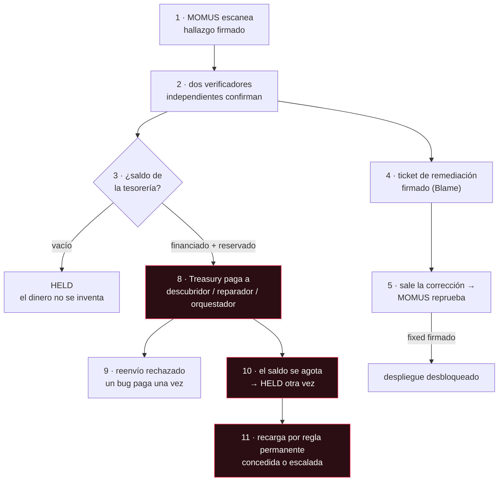

# La cadena completa en UNI — cada transacción, y qué significa

> 🌐 [English](uni-chain.md) · [Русский](uni-chain.ru.md) · **Español** · [Français](uni-chain.fr.md) · [中文](uni-chain.zh.md)

Esta es toda la economía de seguridad funcionando de principio a fin en el nivel **UNI** en
producción: se halla un bug, se confirma de forma independiente, se arregla, se pasa el control y se
paga con un saldo de tesorería que se financia, se consume y puede agotarse de verdad. Cada paso de
abajo se ejecutó en vivo, y cada transacción está explicada — porque una cifra sin significado no es
una cadena de auditoría.

## ⚠️ Qué es real y qué está simulado

- **Real**: las sondas, las llamadas de red, las firmas Ed25519, las comprobaciones de independencia,
  la guarda de deduplicación, el control de despliegue y la clave separada de la tesorería. Todo ello
  se ejecutó sobre los servicios desplegados.
- **Simulado**: el dinero. La liquidación UNI es contabilidad — cada parte está marcada
  `simulated: true` y **no se mueve ningún valor a ninguna parte**. La liquidación real necesita una
  activación explícita aparte, por encima del interruptor maestro de la cripto (véase el
  [aviso](../README.md#settlement--and-a-disclaimer-worth-reading)).
- **Un montaje, no un incidente**: el objetivo es el [canario](../canary/README.md) — un servicio
  construido para incumplir su propio contrato, de modo que se pueda ver dispararse el pipeline. Los
  componentes reales del ecosistema pasaron sus escaneos.

## La cadena



## Paso a paso, tal como ocurrió

| # | Paso | Qué significa | Resultado |
|---|------|---------------|--------|
| 1 | **escaneo** | MOMUS sondeó el contrato que el propio canario declara y lo incumplió. El hallazgo está firmado con la clave del escáner, verificable sin conexión por cualquiera. | `mom-1a639e402537…` · HIGH · firmado |
| 2 | **verificación** | Dos principales **independientes** volvieron a ejecutar la misma sonda determinista, cada uno firmando con su propia clave. HIGH exige dos verificadores distintos, uno de ellos externo registrado. | `8NRt5lKD…` + `TdmS0DVu…` · las tres claves distintas |
| 3 | **tesorería vacía** | Con saldo cero, *la misma reclamación válida* queda en **HELD**, no se paga. Una tesorería sin fondos se niega a inventar dinero. Este es el fallo honesto — y la razón de que exista la bóveda (vault). | `held` |
| 4 | **ticket de remediación** | El hallazgo confirmado se convierte en un traspaso firmado: una atestación de culpa (Blame) que nombra el componente culpable, más la sonda exacta que hay que volver a ejecutar como control. `route=auto` porque el canario no es el núcleo de seguridad. | ruta `auto` · Blame firmada |
| 5 | **control de despliegue** | La corrección salió y MOMUS volvió a ejecutar *justo la sonda que encontró el bug*. Solo un veredicto `fixed` firmado desbloquea un redespliegue — el hallazgo es su propia prueba de regresión. | `fixed=true` · firmado |
| 6 | **fund** (financiar) | El dinero **entra** en la bóveda. La única vía de entrada aparte de una garantía confiscada. | +$200 → saldo $200 |
| 7 | **reserve** (reservar) | El fondo común queda **apartado** — sigue en la bóveda, ya no está disponible. Esto es lo que impide que dos reclamaciones simultáneas gasten el mismo dólar. | reservado $50 · disponible $150 |
| 8 | **pago** | La Treasury — *un servicio distinto que tiene una clave distinta* — liberó la recompensa desde la reserva. | `paid` $50 · `authorized_by` ≠ escáner |
| 9 | **reenvío** | El mismo bug reenviado se **rechaza**. La identidad de deduplicación se recalcula a partir del contenido, así que un reclamante no puede renombrar para llegar a un segundo pago. | `refused` |
| 10 | **agotado** | Con el saldo comprometido en otra parte, un **nuevo hallazgo válido** queda en HELD. El presupuesto se agota de verdad; nada se disimula. | `held` |
| 11 | **recarga por regla** | La recarga es una **regla** permanente, no una decisión. | véase abajo |

## El diario de la bóveda — cada línea se explica sola

Abajo van las cuatro líneas del diario tal cual; la explicación de la derecha la da el propio
servicio (en inglés):

```
fund       $200.00   bal=$200.00  avail=$200.00   an operator added simulated budget — the only way money enters the vault
reserve     $50.00   bal=$200.00  avail=$150.00   a bounty cleared the payout gate; its pool is set aside and no longer available
release     $50.00   bal=$150.00  avail=$150.00   a contributor's share left the vault (finder / fixer / conductor)
reserve    $150.00   bal=$150.00  avail=$  0.00   a bounty cleared the payout gate; its pool is set aside and no longer available
```

Hay exactamente seis tipos de transacción, y la bóveda informa de lo que significa cada uno en
`GET /vault` → `transaction_meanings`:

| tipo | significado |
|------|---------|
| `fund` | un operador añadió presupuesto simulado — la única forma en que el dinero entra en la bóveda |
| `reserve` | una recompensa pasó el control de pago; su fondo común queda apartado y ya no está disponible |
| `release` | la parte de un contribuyente salió de la bóveda (descubridor / reparador / orquestador) |
| `unreserve` | se canceló una reserva sin pagar; los fondos vuelven a estar disponibles |
| `forfeit` | se confiscó la garantía de un reclamante refutado — el spam financia al lado honesto |
| `refund` | la garantía de un reclamante se devolvió porque su reclamación no fue refutada |

## Quién la recarga, y por qué es una regla

Cuando el saldo se agota, alguien tiene que añadir más — y *quién decide* es una cuestión de
gobernanza con una respuesta de seguridad.

**La financia el hub, por una regla permanente y no por una decisión.** El hub es donde aterrizan los
ingresos del ecosistema, y la seguridad es un coste de operar un marketplace en el que la gente
confía — igual que la prevención del fraude se financia con las comisiones de transacción. Quien se
beneficia de la confianza debería pagarla.

La parte crítica es que sea una **regla**. Si un humano o un agente tuviera que aprobar cada recarga,
esa parte podría **matar de hambre al auditor exactamente cuando el auditor encuentra algo
vergonzoso** — la misma captura que la separación de claves existe para evitar. Por eso:

- **tirar, no empujar (pull, not push)** — la Treasury solicita una recarga cuando los fondos
  disponibles caen por debajo de un umbral;
- **una tasa permanente** — atendida automáticamente hasta `rate_bps` del volumen de invocaciones
  (invoke) liquidadas en el periodo, con el tope de `period_cap_usd`. Dentro de la regla no hace
  falta ninguna aprobación;
- **escalar por encima de la regla** — una solicitud que exceda la asignación se rechaza *con su
  aritmética* y se enruta a la gobernanza humana. Nunca se desfinancia al auditor en silencio, ni se
  desangra al financiador en silencio;
- **fail-closed (cierre seguro)** — sin asignador, o con volumen liquidado cero, la bóveda simplemente
  se agota y las recompensas se convierten en intenciones HELD. Un presupuesto agotado se informa,
  nunca se oculta.

Ambas ramas se ejecutaron en vivo (las respuestas van tal cual, en inglés):

```
granted   → "granted $250.00 under the standing rule (200bps of $12500.00 settled volume,
             source: operator-declared (no hub configured))"          balance $150 → $400
escalated → "standing allowance exhausted for this 24h period (rule: 200bps of $0.00 settled
             = $0.00, cap $500.00, already granted $0.00) — escalating to human governance
             instead of defunding the auditor silently"               balance unchanged
```

Fíjate en el campo `source`: siempre dice si el volumen fue **medido desde el hub** o **declarado por
el operador**, de modo que una asignación concedida nunca puede parecer anclada a actividad económica
real cuando no lo estaba.

## Configuración

| variable | significado | por defecto |
|---|---|---|
| `TREASURY_VAULT_PATH` | el diario de solo adición de la bóveda | `<data>/uni_vault.jsonl` |
| `TREASURY_CLIENT_TOKEN` | token del llamante para las rutas de pago y de escritura en la bóveda (fail-closed en producción) | unset (sin definir) |
| `TREASURY_SCANNER_PUBKEYS` | allowlist (lista blanca) de claves de escáner reclamantes | unset (sin definir) = cualquiera |
| `MOMUS_BUDGET_RATE_BPS` | parte del volumen liquidado que fluye al presupuesto de seguridad | `200` (2%) |
| `MOMUS_BUDGET_PERIOD_CAP_USD` | techo duro por periodo | `500` |
| `MOMUS_BUDGET_THRESHOLD_USD` | solicitar una recarga cuando el disponible cae por debajo de esto | `50` |
| `MOMUS_BUDGET_TARGET_USD` | recargar hasta este nivel | `250` |
| `MOMUS_BUDGET_HUB_URL` | leer el volumen liquidado desde el hub | unset (sin definir) |
| `MOMUS_BUDGET_DECLARED_VOLUME_USD` | volumen declarado por el operador cuando no hay hub (simulación) | `0` |

## Reprodúcelo

```bash
docker exec -e CANARY_TOKEN=$CANARY_TOKEN -e TREASURY_CLIENT_TOKEN=$TREASURY_CLIENT_TOKEN \
  momus-backend python /tmp/uni_chain.py
```

El registro JSON completo — cada firma, cada resumen criptográfico, todo el diario — se escribe en
`/data/uni_chain/record.json` dentro del contenedor `momus-backend`. El canario se reinicia a su
estado roto al final, así que la cadena puede volver a ejecutarse.

Véase también: [el primer ciclo completo](first-cycle.md) y el
[reparto de la recompensa](../README.md#splitting-the-bounty-across-the-pipeline).
