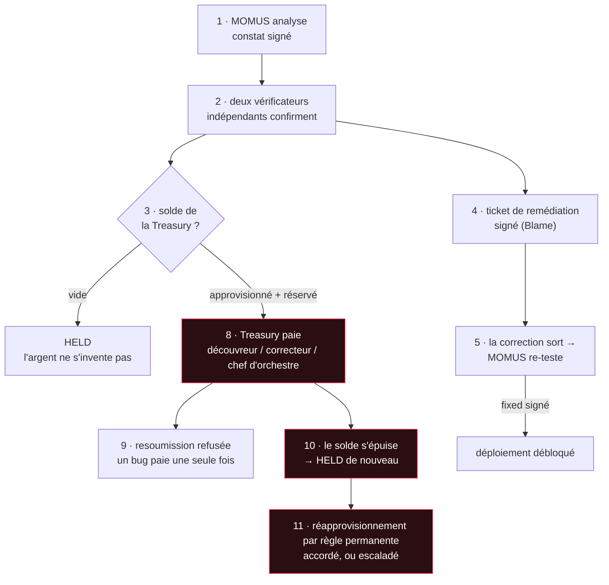

# La chaîne complète en UNI — chaque transaction, et ce qu'elle signifie

> 🌐 [English](uni-chain.md) · [Русский](uni-chain.ru.md) · [Español](uni-chain.es.md) · **Français** · [中文](uni-chain.zh.md)

Voici toute l'économie de la sécurité qui tourne de bout en bout au palier **UNI** en production : un
bug est trouvé, confirmé de façon indépendante, corrigé, soumis au contrôle, puis payé sur le solde de
la Treasury, qui est approvisionné, consommé et peut réellement s'épuiser. Chaque étape ci-dessous
a été exécutée en vrai, et chaque transaction est expliquée — car un montant sans signification n'est
pas une chaîne d'audit.

## ⚠️ Ce qui est réel et ce qui est simulé

- **Réel** : les sondes, les appels réseau, les signatures Ed25519, les contrôles d'indépendance, la
  garde de déduplication, le contrôle de déploiement et la clé distincte de la Treasury. Tout cela
  s'est exécuté sur les services déployés.
- **Simulé** : l'argent. Le règlement UNI est de la comptabilité — chaque part est marquée
  `simulated: true` et **aucune valeur ne bouge où que ce soit**. Un règlement réel exige une
  activation explicite distincte, par-dessus l'interrupteur maître de la crypto (voir
  l'[avertissement](../README.md#settlement--and-a-disclaimer-worth-reading)).
- **Un banc d'essai, pas un incident** : la cible est le [canari](../canary/README.md) — un service
  construit pour enfreindre son propre contrat, afin qu'on puisse voir le pipeline se déclencher. Les
  vrais composants de l'écosystème ont passé leurs analyses.

## La chaîne



## Étape par étape, telle que l'exécution s'est déroulée

| # | Étape | Ce que cela signifie | Résultat |
|---|------|---------------|--------|
| 1 | **analyse** | MOMUS a sondé le contrat que le canari déclare lui-même, et le canari l'a enfreint. Le constat est signé par la clé du scanner, vérifiable hors ligne par n'importe qui. | `mom-1a639e402537…` · HIGH · signé |
| 2 | **vérification** | Deux principaux **indépendants** ont relancé la même sonde déterministe, chacun signant avec sa propre clé. HIGH exige deux vérificateurs distincts, dont un externe enregistré. | `8NRt5lKD…` + `TdmS0DVu…` · les trois clés distinctes |
| 3 | **Treasury vide** | Avec un solde nul, *la même réclamation valide* passe en **HELD** au lieu d'être payée. Non approvisionnée, la Treasury refuse d'inventer de l'argent. C'est l'échec honnête — et la raison d'être du coffre (vault). | `held` |
| 4 | **ticket de remédiation** | Le constat confirmé devient une passation signée : une attestation de responsabilité (Blame) qui nomme le composant fautif, plus la sonde exacte à relancer en guise de contrôle. `route=auto` parce que le canari n'est pas le cœur de sécurité. | route `auto` · Blame signée |
| 5 | **contrôle de déploiement** | La correction est sortie et MOMUS a relancé *la sonde même qui a trouvé le bug*. Seul un verdict `fixed` signé débloque un redéploiement — le constat est son propre test de régression. | `fixed=true` · signé |
| 6 | **fund** (approvisionner) | L'argent **entre** dans le coffre. La seule voie entrante en dehors d'une caution confisquée. | +$200 → solde $200 |
| 7 | **reserve** (réserver) | Le pot commun est **mis de côté** — toujours dans le coffre, mais plus disponible. C'est ce qui empêche deux réclamations concurrentes de dépenser le même dollar. | réservé $50 · disponible $150 |
| 8 | **versement** | La Treasury — *un service différent détenant une clé différente* — a libéré la prime depuis la réservation. | `paid` $50 · `authorized_by` ≠ scanner |
| 9 | **resoumission** | Le même bug resoumis est **refusé**. L'identité de déduplication est recalculée à partir du contenu : un réclamant ne peut donc pas se renommer pour obtenir un second versement. | `refused` |
| 10 | **épuisé** | Le solde étant engagé ailleurs, un **nouveau constat valide** passe en HELD. Le budget s'épuise réellement ; rien n'est enjolivé. | `held` |
| 11 | **réapprovisionnement par règle** | Le réapprovisionnement est une **règle** permanente, pas une décision. | voir ci-dessous |

## Le journal du coffre — chaque ligne s'explique elle-même

Ci-dessous les quatre lignes du journal telles quelles ; l'explication à droite est fournie par le
service lui-même (en anglais) :

```
fund       $200.00   bal=$200.00  avail=$200.00   an operator added simulated budget — the only way money enters the vault
reserve     $50.00   bal=$200.00  avail=$150.00   a bounty cleared the payout gate; its pool is set aside and no longer available
release     $50.00   bal=$150.00  avail=$150.00   a contributor's share left the vault (finder / fixer / conductor)
reserve    $150.00   bal=$150.00  avail=$  0.00   a bounty cleared the payout gate; its pool is set aside and no longer available
```

Il existe exactement six types de transaction, et le coffre indique lui-même ce que chacun signifie
sur `GET /vault` → `transaction_meanings` :

| type | signification |
|------|---------|
| `fund` | un opérateur a ajouté du budget simulé — la seule façon dont l'argent entre dans le coffre |
| `reserve` | une prime a franchi le contrôle de versement ; son pot commun est mis de côté et n'est plus disponible |
| `release` | la part d'un contributeur a quitté le coffre (découvreur / correcteur / chef d'orchestre) |
| `unreserve` | une réservation a été annulée sans versement ; les fonds sont de nouveau disponibles |
| `forfeit` | la caution d'un réclamant réfuté a été confisquée — le spam finance le camp honnête |
| `refund` | la caution d'un réclamant a été rendue parce que sa réclamation n'a pas été réfutée |

## Qui le réapprovisionne, et pourquoi c'est une règle

Quand le solde s'épuise, quelqu'un doit en remettre — et *qui décide* est une question de gouvernance
dont la réponse relève de la sécurité.

**C'est le hub qui l'approvisionne, par une règle permanente plutôt que par une décision.** Le hub est
là où atterrissent les revenus de l'écosystème, et la sécurité est un coût d'exploitation d'une place
de marché à laquelle les gens font confiance — de la même façon que la lutte contre la fraude est
financée par les frais de transaction. Qui bénéficie de la confiance devrait la payer.

Le point critique, c'est qu'il s'agit d'une **règle**. S'il fallait qu'un humain ou un agent approuve
chaque réapprovisionnement, cette partie pourrait **affamer l'auditeur précisément au moment où
l'auditeur trouve quelque chose de gênant** — la capture même que la séparation des clés existe pour
empêcher. Donc :

- **tirer, pas pousser (pull, not push)** — la Treasury demande un réapprovisionnement quand les fonds
  disponibles tombent sous un seuil ;
- **un taux permanent** — honoré automatiquement à hauteur de `rate_bps` du volume d'invocations
  (invoke) réglées sur la période, plafonné par `period_cap_usd`. Aucune approbation n'est nécessaire
  à l'intérieur de la règle ;
- **escalader au-delà de la règle** — une demande dépassant l'allocation est refusée *avec son
  arithmétique* et acheminée vers la gouvernance humaine. L'auditeur n'est jamais définancé en
  silence, le financeur jamais vidé en silence ;
- **fail-closed (fermeture sécurisée)** — pas d'allocateur, ou un volume réglé nul, signifie que le
  coffre s'épuise tout simplement et que les primes deviennent des intentions HELD. Un budget épuisé
  est signalé, jamais caché.

Les deux branches ont été exécutées en vrai (les réponses sont reproduites telles quelles, en
anglais) :

```
granted   → "granted $250.00 under the standing rule (200bps of $12500.00 settled volume,
             source: operator-declared (no hub configured))"          balance $150 → $400
escalated → "standing allowance exhausted for this 24h period (rule: 200bps of $0.00 settled
             = $0.00, cap $500.00, already granted $0.00) — escalating to human governance
             instead of defunding the auditor silently"               balance unchanged
```

Notez le champ `source` : il dit toujours si le volume a été **mesuré depuis le hub** ou **déclaré par
l'opérateur**, de sorte qu'une allocation accordée ne peut jamais paraître ancrée dans une activité
économique réelle quand elle ne l'était pas.

## Configuration

| variable | signification | par défaut |
|---|---|---|
| `TREASURY_VAULT_PATH` | le journal en ajout seul du coffre | `<data>/uni_vault.jsonl` |
| `TREASURY_CLIENT_TOKEN` | jeton de l'appelant pour les routes de versement et d'écriture du coffre (fail-closed en production) | unset (non défini) |
| `TREASURY_SCANNER_PUBKEYS` | allowlist (liste blanche) des clés de scanner réclamantes | unset (non défini) = n'importe laquelle |
| `MOMUS_BUDGET_RATE_BPS` | part du volume réglé qui alimente le budget de sécurité | `200` (2%) |
| `MOMUS_BUDGET_PERIOD_CAP_USD` | plafond dur par période | `500` |
| `MOMUS_BUDGET_THRESHOLD_USD` | demander un réapprovisionnement quand le disponible tombe sous ce seuil | `50` |
| `MOMUS_BUDGET_TARGET_USD` | réapprovisionner jusqu'à ce niveau | `250` |
| `MOMUS_BUDGET_HUB_URL` | lire le volume réglé depuis le hub | unset (non défini) |
| `MOMUS_BUDGET_DECLARED_VOLUME_USD` | volume déclaré par l'opérateur en l'absence de hub (simulation) | `0` |

## Reproduisez-le

```bash
docker exec -e CANARY_TOKEN=$CANARY_TOKEN -e TREASURY_CLIENT_TOKEN=$TREASURY_CLIENT_TOKEN \
  momus-backend python /tmp/uni_chain.py
```

Le relevé JSON complet — chaque signature, chaque empreinte, tout le journal — est écrit dans
`/data/uni_chain/record.json` à l'intérieur du conteneur `momus-backend`. Le canari se remet de
lui-même en état défaillant à la fin, de sorte que la chaîne peut être relancée.

Voir aussi : [le premier cycle complet](first-cycle.md) et la
[répartition de la prime](../README.md#splitting-the-bounty-across-the-pipeline).
