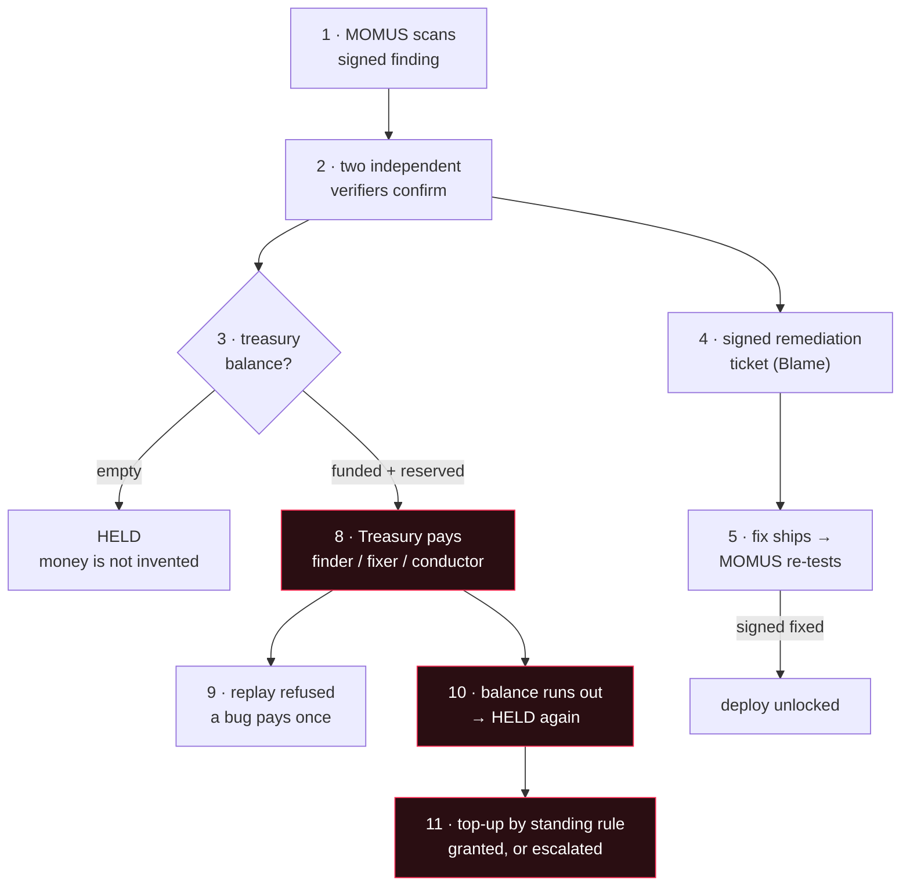

# The full chain in UNI — every transaction, and what it means

> 🌐 **English** · [Русский](uni-chain.ru.md) · [Español](uni-chain.es.md) · [Français](uni-chain.fr.md) · [中文](uni-chain.zh.md)

This is the whole security economy running end to end in the **UNI** tier on production: a bug is
found, independently confirmed, fixed, gated, and paid out of a treasury balance that is funded,
drawn down, and can genuinely run out. Every step below was executed live, and every transaction is
explained — because an amount without a meaning is not an audit trail.

## ⚠️ What is real and what is simulated

- **Real**: the probes, the network calls, the Ed25519 signatures, the independence checks, the
  dedup guard, the deploy gate, and the treasury's separate key. All of it ran on the deployed
  services.
- **Simulated**: the money. UNI settlement is bookkeeping — every share is marked
  `simulated: true` and **no value moves anywhere**. Real settlement needs a separate opt-in on top
  of the crypto master switch (see the [disclaimer](../README.md#settlement--and-a-disclaimer-worth-reading)).
- **A fixture, not an incident**: the target is the [canary](../canary/README.md) — a service built
  to break its own contract so the pipeline can be seen to fire. The ecosystem's real components
  passed their scans.

## The chain



## Step by step, as it actually ran

| # | Step | What it means | Result |
|---|------|---------------|--------|
| 1 | **scan** | MOMUS probed the canary's own declared contract and it broke it. The finding is signed by the scanner key, verifiable offline by anyone. | `mom-1a639e402537…` · HIGH · signed |
| 2 | **verify** | Two **independent** principals re-ran the same deterministic probe, each signing with its own key. HIGH needs two distinct verifiers, one of them registered external. | `8NRt5lKD…` + `TdmS0DVu…` · all three keys distinct |
| 3 | **empty treasury** | With a zero balance the *same valid claim* is **HELD**, not paid. An unfunded treasury refuses to invent money. This is the honest failure — and the reason the vault exists. | `held` |
| 4 | **remediation ticket** | The confirmed finding becomes a signed hand-off: a Blame attestation naming the at-fault component plus the exact probe to re-run as the gate. `route=auto` because the canary is not the security core. | route `auto` · Blame signed |
| 5 | **deploy gate** | The fix shipped and MOMUS re-ran *the very probe that found the bug*. Only a signed `fixed` verdict unlocks a redeploy — the finding is its own regression test. | `fixed=true` · signed |
| 6 | **fund** | Money **enters** the vault. The only inbound path besides a forfeited deposit. | +$200 → balance $200 |
| 7 | **reserve** | The pool is **set aside** — still in the vault, no longer available. This is what stops two concurrent claims spending the same dollar. | reserved $50 · available $150 |
| 8 | **pay** | The Treasury — a *different service holding a different key* — released the bounty from the reservation. | `paid` $50 · `authorized_by` ≠ scanner |
| 9 | **replay** | The same bug resubmitted is **refused**. Dedup identity is recomputed from content, so a claimant cannot rename its way to a second payout. | `refused` |
| 10 | **exhausted** | With the balance committed elsewhere, a **new valid finding** is HELD. The budget genuinely runs out; nothing is papered over. | `held` |
| 11 | **top-up by rule** | The refill is a standing **rule**, not a decision. | see below |

## The vault journal — each line explains itself

```
fund       $200.00   bal=$200.00  avail=$200.00   an operator added simulated budget — the only way money enters the vault
reserve     $50.00   bal=$200.00  avail=$150.00   a bounty cleared the payout gate; its pool is set aside and no longer available
release     $50.00   bal=$150.00  avail=$150.00   a contributor's share left the vault (finder / fixer / conductor)
reserve    $150.00   bal=$150.00  avail=$  0.00   a bounty cleared the payout gate; its pool is set aside and no longer available
```

There are exactly six transaction kinds, and the vault reports what each one means at
`GET /vault` → `transaction_meanings`:

| kind | meaning |
|------|---------|
| `fund` | an operator added simulated budget — the only way money enters the vault |
| `reserve` | a bounty cleared the payout gate; its pool is set aside and no longer available |
| `release` | a contributor's share left the vault (finder / fixer / conductor) |
| `unreserve` | a reservation was cancelled without paying; the funds are available again |
| `forfeit` | a refuted claimant's deposit was taken — spam funds the honest side |
| `refund` | a claimant's deposit returned because their claim was not refuted |

## Who refills it, and why it is a rule

When the balance runs out, someone has to add more — and *who decides* is a governance question
with a security answer.

**The hub funds it, by a standing rule rather than a decision.** The hub is where the ecosystem's
revenue lands, and security is a cost of running a marketplace people trust — the same way fraud
prevention is funded out of transaction fees. Whoever benefits from trust should pay for it.

The critical part is that it is a **rule**. If a human or an agent had to approve each refill, that
party could **starve the auditor exactly when the auditor finds something embarrassing** — the same
capture the key separation exists to prevent. So:

- **pull, not push** — the Treasury requests a top-up when available funds fall below a threshold;
- **a standing rate** — honoured automatically up to `rate_bps` of settled invoke volume in the
  period, capped by `period_cap_usd`. No approval needed inside the rule;
- **escalate above the rule** — a request beyond the allowance is refused *with its arithmetic* and
  routed to human governance. The auditor is never silently defunded, the funder never silently
  drained;
- **fail-closed** — no allocator, or zero settled volume, means the vault simply runs out and
  bounties become HELD intents. An exhausted budget is reported, never hidden.

Both branches ran live:

```
granted   → "granted $250.00 under the standing rule (200bps of $12500.00 settled volume,
             source: operator-declared (no hub configured))"          balance $150 → $400
escalated → "standing allowance exhausted for this 24h period (rule: 200bps of $0.00 settled
             = $0.00, cap $500.00, already granted $0.00) — escalating to human governance
             instead of defunding the auditor silently"               balance unchanged
```

Note the `source` field: it always says whether the volume was **measured from the hub** or
**operator-declared**, so a granted allocation can never look anchored to real economic activity
when it was not.

## Configuration

| variable | meaning | default |
|---|---|---|
| `TREASURY_VAULT_PATH` | the vault's append-only journal | `<data>/uni_vault.jsonl` |
| `TREASURY_CLIENT_TOKEN` | caller token for the payout + vault write routes (fail-closed in prod) | unset |
| `TREASURY_SCANNER_PUBKEYS` | allowlist of claimant scanner keys | unset = any |
| `MOMUS_BUDGET_RATE_BPS` | share of settled volume flowing to the security budget | `200` (2%) |
| `MOMUS_BUDGET_PERIOD_CAP_USD` | hard ceiling per period | `500` |
| `MOMUS_BUDGET_THRESHOLD_USD` | request a top-up when available drops below this | `50` |
| `MOMUS_BUDGET_TARGET_USD` | top up to this level | `250` |
| `MOMUS_BUDGET_HUB_URL` | read settled volume from the hub | unset |
| `MOMUS_BUDGET_DECLARED_VOLUME_USD` | operator-declared volume when there is no hub (simulation) | `0` |

## Reproduce it

```bash
docker exec -e CANARY_TOKEN=$CANARY_TOKEN -e TREASURY_CLIENT_TOKEN=$TREASURY_CLIENT_TOKEN \
  momus-backend python /tmp/uni_chain.py
```

The full JSON record — every signature, every digest, the whole journal — is written to
`/data/uni_chain/record.json` inside the `momus-backend` container. The canary resets itself to
broken at the end, so the chain can be run again.

See also: [the first complete cycle](first-cycle.md), and the
[bounty split](../README.md#splitting-the-bounty-across-the-pipeline).
