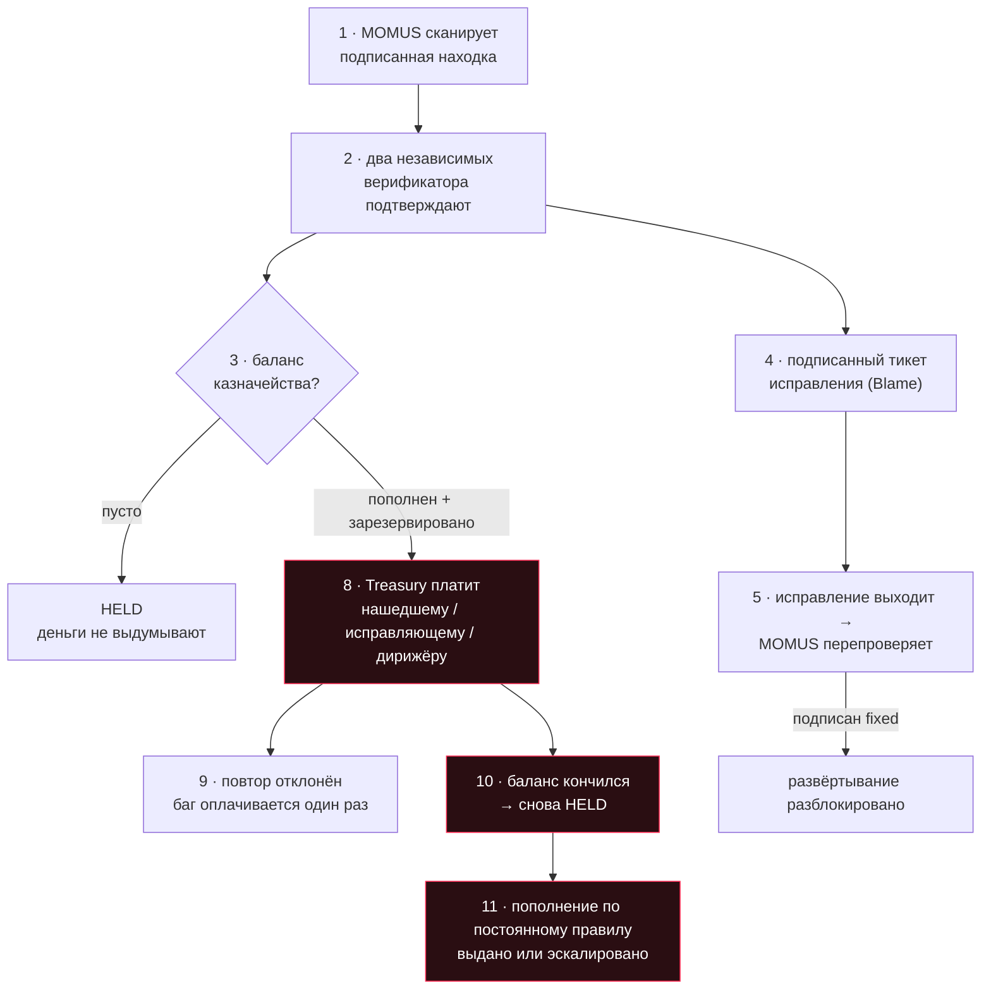

# Полная цепочка в UNI — каждая транзакция и что она означает

> 🌐 [English](uni-chain.md) · **Русский** · [Español](uni-chain.es.md) · [Français](uni-chain.fr.md) · [中文](uni-chain.zh.md)

Это вся экономика безопасности целиком, от начала до конца, на уровне **UNI** и на проде: баг
находят, независимо подтверждают, исправляют, пропускают через шлюз и оплачивают из баланса
казначейства, который пополняется, расходуется и может по-настоящему закончиться. Каждый шаг ниже
был выполнен вживую, и каждая транзакция объяснена — потому что сумма без смысла не является
цепочкой аудита.

## ⚠️ Что реально, а что симуляция

- **Реально**: пробы, сетевые вызовы, подписи Ed25519, проверки независимости, защита от дублей
  (дедуп), шлюз развёртывания и отдельный ключ казначейства. Всё это работало на развёрнутых
  сервисах.
- **Симуляция**: деньги. Расчёт в UNI — это бухгалтерия: каждая доля помечена `simulated: true`, и
  **никакая ценность никуда не двигается**. Настоящий расчёт требует отдельного явного включения
  поверх главного тумблера крипты (см. [дисклеймер](../README.md#settlement--and-a-disclaimer-worth-reading)).
- **Это тестовый стенд, а не инцидент**: цель — [канарейка](../canary/README.md), сервис,
  построенный так, чтобы нарушать собственный контракт, — чтобы конвейер можно было увидеть в
  действии. Настоящие компоненты экосистемы свои сканирования прошли.

## Цепочка



## Шаг за шагом, как это прошло на самом деле

| # | Шаг | Что это значит | Результат |
|---|------|---------------|--------|
| 1 | **сканирование** | MOMUS проверил пробами контракт, объявленный самой канарейкой, — и она его нарушила. Находка подписана ключом сканера и проверяется офлайн кем угодно. | `mom-1a639e402537…` · HIGH · подписана |
| 2 | **верификация** | Две **независимые** стороны заново прогнали ту же детерминированную пробу, каждая подписала своим ключом. Для HIGH нужны два различных верификатора, один из них — зарегистрированный внешний. | `8NRt5lKD…` + `TdmS0DVu…` · все три ключа различны |
| 3 | **пустое казначейство** | При нулевом балансе *та же действительная заявка* получает **HELD**, а не оплату. Непополненное казначейство отказывается выдумывать деньги. Это честный отказ — и причина, по которой хранилище (vault) вообще существует. | `held` |
| 4 | **тикет исправления** | Подтверждённая находка превращается в подписанную передачу работы: аттестация вины (Blame) с указанием виновного компонента плюс точная проба, которую нужно прогнать заново в роли шлюза. `route=auto`, потому что канарейка — не ядро безопасности. | маршрут `auto` · Blame подписана |
| 5 | **шлюз развёртывания** | Исправление вышло, и MOMUS заново прогнал *ровно ту пробу, которая нашла баг*. Разблокировать переразвёртывание может только подписанный вердикт `fixed` — находка сама себе регрессионный тест. | `fixed=true` · подписан |
| 6 | **fund** (пополнение) | Деньги **входят** в хранилище. Единственный входящий путь, кроме изъятого залога. | +$200 → баланс $200 |
| 7 | **reserve** (резервирование) | Пул **откладывается в сторону** — он всё ещё в хранилище, но больше не доступен. Именно это не даёт двум одновременным заявкам потратить один и тот же доллар. | зарезервировано $50 · доступно $150 |
| 8 | **выплата** | Treasury — *другой сервис с другим ключом* — выдал вознаграждение из резерва. | `paid` $50 · `authorized_by` ≠ сканер |
| 9 | **повтор** | Тот же баг, отправленный повторно, **отклоняется**. Идентичность для дедупликации пересчитывается из содержимого, поэтому заявитель не может переименованием добраться до второй выплаты. | `refused` |
| 10 | **исчерпано** | Когда баланс связан другими обязательствами, **новая действительная находка** получает HELD. Бюджет по-настоящему заканчивается; ничего не заметается под ковёр. | `held` |
| 11 | **пополнение по правилу** | Пополнение — это постоянное **правило**, а не решение. | см. ниже |

## Журнал хранилища — каждая строка объясняет себя сама

Ниже — четыре строки журнала как есть; пояснение справа в каждой строке выдаёт сам сервис
(по-английски):

```
fund       $200.00   bal=$200.00  avail=$200.00   an operator added simulated budget — the only way money enters the vault
reserve     $50.00   bal=$200.00  avail=$150.00   a bounty cleared the payout gate; its pool is set aside and no longer available
release     $50.00   bal=$150.00  avail=$150.00   a contributor's share left the vault (finder / fixer / conductor)
reserve    $150.00   bal=$150.00  avail=$  0.00   a bounty cleared the payout gate; its pool is set aside and no longer available
```

Видов транзакций ровно шесть, и хранилище само сообщает, что означает каждый из них, по
`GET /vault` → `transaction_meanings`:

| вид | значение |
|------|---------|
| `fund` | оператор добавил симулированный бюджет — единственный способ, которым деньги попадают в хранилище |
| `reserve` | вознаграждение прошло шлюз выплаты; его пул отложен в сторону и больше не доступен |
| `release` | доля участника покинула хранилище (нашедший / исправляющий / дирижёр) |
| `unreserve` | резерв отменён без выплаты; средства снова доступны |
| `forfeit` | залог опровергнутого заявителя изъят — спам финансирует честную сторону |
| `refund` | залог заявителя возвращён, потому что его заявку не опровергли |

## Кто его пополняет и почему это правило

Когда баланс кончается, кто-то должен добавить ещё — и *кто это решает* — вопрос управления с
ответом из области безопасности.

**Пополняет его хаб, по постоянному правилу, а не по решению.** Хаб — это место, куда приходит
выручка экосистемы, а безопасность — издержка содержания маркетплейса, которому доверяют, — так же,
как борьбу с мошенничеством финансируют из комиссий за транзакции. Кто выигрывает от доверия, тот и
должен за него платить.

Критично именно то, что это **правило**. Если бы каждое пополнение должен был одобрять человек или
агент, эта сторона могла бы **заморить аудитора голодом ровно тогда, когда аудитор находит нечто
компрометирующее**, — тот самый захват, ради предотвращения которого и существует разделение ключей.
Поэтому:

- **вытягивание, а не вталкивание (pull, not push)** — Treasury сам запрашивает пополнение, когда
  доступные средства падают ниже порога;
- **постоянная ставка** — исполняется автоматически в пределах `rate_bps` от объёма расчётов по
  вызовам (invoke) за период, с потолком `period_cap_usd`. Внутри правила никакого одобрения не
  нужно;
- **эскалация выше правила** — запрос сверх лимита отклоняется *вместе со своей арифметикой* и
  уходит в человеческое управление. Аудитора никогда не лишают финансирования молча, а того, кто
  финансирует, никогда молча не обескровливают;
- **fail-closed (отказ в безопасную сторону)** — нет распределителя или нулевой расчётный объём
  означает, что хранилище просто пустеет, а вознаграждения становятся намерениями HELD. Об
  исчерпанном бюджете сообщают, его никогда не скрывают.

Обе ветки были прогнаны вживую (ответы приведены как есть, по-английски):

```
granted   → "granted $250.00 under the standing rule (200bps of $12500.00 settled volume,
             source: operator-declared (no hub configured))"          balance $150 → $400
escalated → "standing allowance exhausted for this 24h period (rule: 200bps of $0.00 settled
             = $0.00, cap $500.00, already granted $0.00) — escalating to human governance
             instead of defunding the auditor silently"               balance unchanged
```

Обратите внимание на поле `source`: оно всегда говорит, был ли объём **измерен по хабу** или
**объявлен оператором**, — так выданное распределение никогда не сможет выглядеть привязанным к
реальной экономической активности, если это не так.

## Конфигурация

| переменная | значение | по умолчанию |
|---|---|---|
| `TREASURY_VAULT_PATH` | журнал хранилища, только на добавление | `<data>/uni_vault.jsonl` |
| `TREASURY_CLIENT_TOKEN` | токен вызывающей стороны для маршрутов выплаты и записи в хранилище (fail-closed на проде) | unset (не задан) |
| `TREASURY_SCANNER_PUBKEYS` | allowlist (белый список) ключей сканеров-заявителей | unset (не задан) = любой |
| `MOMUS_BUDGET_RATE_BPS` | доля расчётного объёма, идущая в бюджет безопасности | `200` (2%) |
| `MOMUS_BUDGET_PERIOD_CAP_USD` | жёсткий потолок за период | `500` |
| `MOMUS_BUDGET_THRESHOLD_USD` | запрашивать пополнение, когда доступное падает ниже этого значения | `50` |
| `MOMUS_BUDGET_TARGET_USD` | пополнять до этого уровня | `250` |
| `MOMUS_BUDGET_HUB_URL` | читать расчётный объём из хаба | unset (не задан) |
| `MOMUS_BUDGET_DECLARED_VOLUME_USD` | объявленный оператором объём, когда хаба нет (симуляция) | `0` |

## Воспроизведите это

```bash
docker exec -e CANARY_TOKEN=$CANARY_TOKEN -e TREASURY_CLIENT_TOKEN=$TREASURY_CLIENT_TOKEN \
  momus-backend python /tmp/uni_chain.py
```

Полная запись в JSON — каждая подпись, каждый дайджест, весь журнал — пишется в
`/data/uni_chain/record.json` внутри контейнера `momus-backend`. В конце канарейка сама сбрасывается
в сломанное состояние, так что цепочку можно прогнать заново.

См. также: [первый полный цикл](first-cycle.md) и
[разделение вознаграждения](../README.md#splitting-the-bounty-across-the-pipeline).
