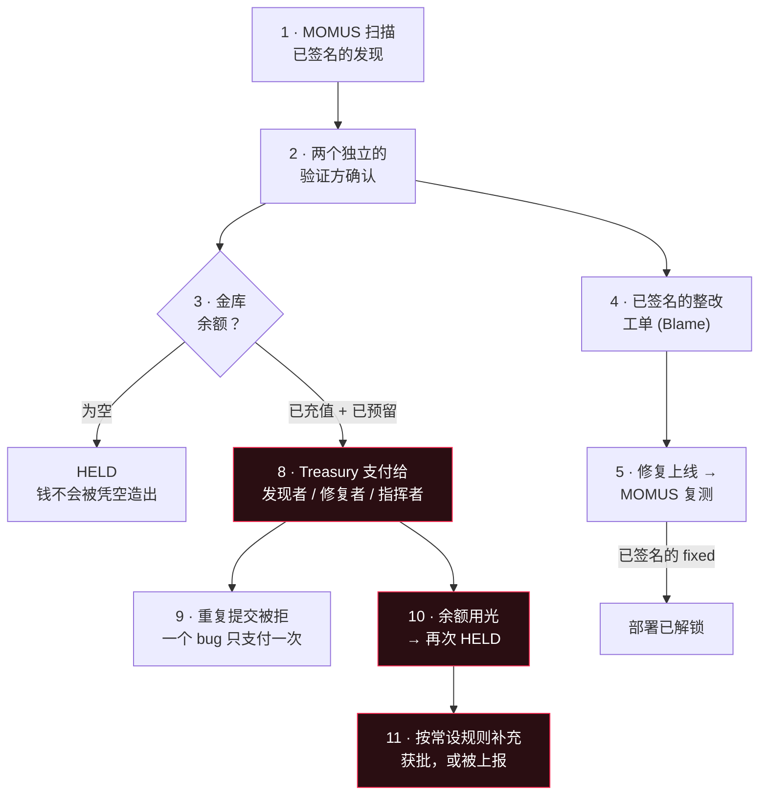

# UNI 中的完整链条 —— 每一笔交易，以及它意味着什么

> 🌐 [English](uni-chain.md) · [Русский](uni-chain.ru.md) · [Español](uni-chain.es.md) · [Français](uni-chain.fr.md) · **中文**

这是整套安全经济在生产环境的 **UNI** 层级上端到端跑通的样子：一个 bug 被发现、被独立确认、被修复、
通过关卡，并从一笔会被充值、会被消耗、也真的会用光的金库余额中支付出去。下面每一步都是实时执行的，
而且每一笔交易都有解释 —— 因为一个没有含义的金额并不构成审计链。

## ⚠️ 什么是真实的，什么是模拟的

- **真实的**：探测、网络调用、Ed25519 签名、独立性检查、去重防护、部署关卡，以及金库自己独立的密钥。
  所有这些都运行在已部署的服务上。
- **模拟的**：钱。UNI 结算只是记账 —— 每一份份额都被标记为 `simulated: true`，而且**没有任何价值
  转移到任何地方**。真实结算需要在加密总开关之上再有一次单独的显式启用（见
  [免责声明](../README.md#settlement--and-a-disclaimer-worth-reading)）。
- **这是一个测试装置，不是一次事故**：目标是 [canary 诱饵服务](../canary/README.md) —— 一个专门
  搭建成会违反自己合约的服务，好让人能看到这条流水线真的触发。生态系统的真实组件都通过了各自的扫描。

## 这条链条



## 逐步来看，实际是怎么跑的

| # | 步骤 | 含义 | 结果 |
|---|------|---------------|--------|
| 1 | **扫描** | MOMUS 用探测检验了 canary 自己声明的合约，而它违反了该合约。这个发现由扫描器密钥签名，任何人都可以离线验证。 | `mom-1a639e402537…` · HIGH · 已签名 |
| 2 | **验证** | 两个**互相独立**的主体重新运行了同一个确定性探测，各自用自己的密钥签名。HIGH 需要两个互不相同的验证方，其中一个是已注册的外部方。 | `8NRt5lKD…` + `TdmS0DVu…` · 三把密钥互不相同 |
| 3 | **金库为空** | 余额为零时，*同一份有效索赔*会被置为 **HELD** 而不是被支付。一个没有资金的金库拒绝凭空造钱。这就是那种诚实的失败 —— 也正是金库（vault）存在的理由。 | `held` |
| 4 | **整改工单** | 被确认的发现变成一次已签名的交接：一份指名出错组件的归责证明（Blame），外加那个要作为关卡重新运行的确切探测。`route=auto`，因为 canary 不属于安全核心。 | 路由 `auto` · Blame 已签名 |
| 5 | **部署关卡** | 修复上线，MOMUS 重新运行了*正是发现这个 bug 的那个探测*。只有一份已签名的 `fixed` 裁定才能解锁重新部署 —— 这个发现就是它自己的回归测试。 | `fixed=true` · 已签名 |
| 6 | **fund**（充值） | 钱**进入**金库。除了被没收的保证金之外，唯一的入账途径。 | +$200 → 余额 $200 |
| 7 | **reserve**（预留） | 资金池被**搁置一旁** —— 它仍在金库里，但不再可用。正是这一点阻止了两份并发索赔花掉同一美元。 | 已预留 $50 · 可用 $150 |
| 8 | **支付** | Treasury —— *一个持有不同密钥的不同服务* —— 从预留中释放了赏金。 | `paid` $50 · `authorized_by` ≠ 扫描器 |
| 9 | **重复提交** | 同一个 bug 再次提交会被**拒绝**。去重身份是从内容重新计算出来的，所以索赔方无法靠改名拿到第二次赔付。 | `refused` |
| 10 | **已耗尽** | 余额已被别处占用时，一个**新的有效发现**会被置为 HELD。预算是真的会用光的；没有任何事情被粉饰过去。 | `held` |
| 11 | **按规则补充** | 补充是一条常设**规则**，不是一次决定。 | 见下文 |

## 金库日志 —— 每一行自己解释自己

下面是日志的四行，原样照录；每行右侧的说明由服务本身给出（英文）：

```
fund       $200.00   bal=$200.00  avail=$200.00   an operator added simulated budget — the only way money enters the vault
reserve     $50.00   bal=$200.00  avail=$150.00   a bounty cleared the payout gate; its pool is set aside and no longer available
release     $50.00   bal=$150.00  avail=$150.00   a contributor's share left the vault (finder / fixer / conductor)
reserve    $150.00   bal=$150.00  avail=$  0.00   a bounty cleared the payout gate; its pool is set aside and no longer available
```

交易种类正好有六种，而金库会在 `GET /vault` → `transaction_meanings` 处报告每一种的含义：

| 种类 | 含义 |
|------|---------|
| `fund` | 运营者添加了模拟预算 —— 钱进入金库的唯一方式 |
| `reserve` | 一笔赏金通过了赔付关卡；它的资金池被搁置一旁，不再可用 |
| `release` | 一位贡献者的份额离开了金库（发现者 / 修复者 / 指挥者） |
| `unreserve` | 一次预留在未支付的情况下被取消；这些资金重新变为可用 |
| `forfeit` | 一位被驳回的索赔方的保证金被没收 —— 垃圾提交在为诚实的一方出资 |
| `refund` | 一位索赔方的保证金被退回，因为其索赔没有被驳回 |

## 谁来补充它，以及为什么这是一条规则

当余额用光时，总得有人再添进去 —— 而*由谁来决定*是一个治理问题，答案却来自安全。

**由 hub 来出资，依据的是一条常设规则，而不是一次决定。** hub 是生态系统营收落地的地方，而安全是运营
一个让人们信任的交易市场的成本 —— 就像反欺诈工作由交易手续费来负担一样。谁从信任中获益，谁就该为它
付钱。

关键之处在于它是一条**规则**。如果每次补充都必须由某个人或某个智能体批准，那一方就可以**正好在审计者
发现某件令人难堪的事情时断了审计者的粮** —— 而这正是密钥分离所要防止的那种俘获。所以：

- **拉取，而不是推送（pull, not push）** —— 当可用资金落到某个阈值以下时，由 Treasury 主动请求补充；
- **一个常设费率** —— 在本期已结算调用（invoke）量的 `rate_bps` 范围内自动兑付，并以
  `period_cap_usd` 为上限。在规则之内无需任何批准；
- **超出规则则上报** —— 超过额度的请求会被拒绝，*并附上它的算术过程*，然后转交人类治理。审计者绝不会
  被悄悄断供，出资方也绝不会被悄悄抽干；
- **fail-closed（失败即拒绝）** —— 没有分配器，或已结算量为零，意味着金库就是会见底，而赏金会变成
  HELD 意向。预算耗尽会被报告出来，绝不会被隐藏。

两个分支都实时跑过（回复原样照录，为英文）：

```
granted   → "granted $250.00 under the standing rule (200bps of $12500.00 settled volume,
             source: operator-declared (no hub configured))"          balance $150 → $400
escalated → "standing allowance exhausted for this 24h period (rule: 200bps of $0.00 settled
             = $0.00, cap $500.00, already granted $0.00) — escalating to human governance
             instead of defunding the auditor silently"               balance unchanged
```

请注意 `source` 字段：它总是说明该量是**由 hub 测得**还是**由运营者申报**，因此一笔获批的分配永远不会
在并非如此的时候，看起来像是锚定在真实经济活动上。

## 配置

| 变量 | 含义 | 默认值 |
|---|---|---|
| `TREASURY_VAULT_PATH` | 金库的仅追加日志 | `<data>/uni_vault.jsonl` |
| `TREASURY_CLIENT_TOKEN` | 赔付路由与金库写入路由的调用方令牌（生产环境 fail-closed） | unset（未设置） |
| `TREASURY_SCANNER_PUBKEYS` | 索赔方扫描器密钥的 allowlist（白名单） | unset（未设置）= 任意 |
| `MOMUS_BUDGET_RATE_BPS` | 流向安全预算的已结算量份额 | `200` (2%) |
| `MOMUS_BUDGET_PERIOD_CAP_USD` | 每期的硬上限 | `500` |
| `MOMUS_BUDGET_THRESHOLD_USD` | 当可用额降到此值以下时请求补充 | `50` |
| `MOMUS_BUDGET_TARGET_USD` | 补充到这个水位 | `250` |
| `MOMUS_BUDGET_HUB_URL` | 从 hub 读取已结算量 | unset（未设置） |
| `MOMUS_BUDGET_DECLARED_VOLUME_USD` | 没有 hub 时由运营者申报的量（模拟） | `0` |

## 复现它

```bash
docker exec -e CANARY_TOKEN=$CANARY_TOKEN -e TREASURY_CLIENT_TOKEN=$TREASURY_CLIENT_TOKEN \
  momus-backend python /tmp/uni_chain.py
```

完整的 JSON 记录 —— 每一个签名、每一个摘要、整份日志 —— 会写入 `momus-backend` 容器内的
`/data/uni_chain/record.json`。canary 会在最后把自己重置回出问题的状态，因此这条链条可以再跑一遍。

另见：[第一个完整周期](first-cycle.md)，以及
[分配赏金](../README.md#splitting-the-bounty-across-the-pipeline)。
